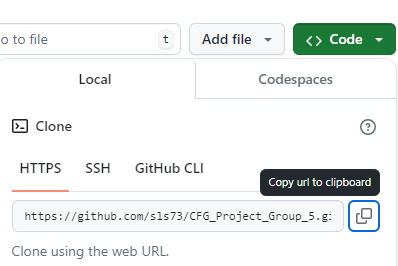
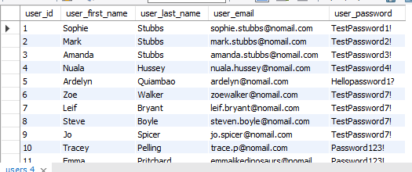

# Movie Recommender

## Introduction
Movie Recommender provides users with a list of 25 personalised movie recommendations based on their top 5 movies and their responses to a magazine-style quiz.

## Installation
Movie Recommender is a Python console app that uses TheMovieDB (TMDB) API and a MySQL DB.


### Prerequisites
Make sure you have the following installed on your system:
- Python 3.7 or higher
- MySQL Server and MySQL Workbench
- Git and Github
- PyCharm

## Step 1: Obtain TMDB API credentials
### 1. Sign up for TMDB and acquire an API Read Access Token.
- Sign up to [TMDB](https://www.themoviedb.org/signup) and follow the instructions for activating your account. 
- After logging in, request an API key [here](https://www.themoviedb.org/settings/api). 
- When asked for the type of API key, select "Developer" and accept the Terms of Use. 
- You will then be required to supply personal details, along with the following details of the application:
  - **Type of Use** – e.g. "Education"
  - **Application Name** – e.g. "Movie Recommender"
  - **Application URL** – e.g. "localhost"
  - **Application Summary** – e.g. "Python console app (educational use only)"
- On completing the application successfully, you will be allocated an API Key and an API Read Access Token (a very long string of alphanumeric characters). 
- Copy the Read Access Token, as you will need it to configure ENV_TMDB_BEARER_TOKEN later.

### 2. Test your TMDB API access
- You can test your TMDB API access is working by visiting the [TMDB API documentation](https://developer.themoviedb.org/reference/search-movie), entering a movie name in the query box and clicking "Try It!".
- You should see JSON returned in the Response window with details of the movie you searched for. If your search worked successfully and you have a copy of your Read Access Token, you are ready to move on.

## Step 2: Clone the repository
1. Clone the `CFG_Project_Group_5` repository to your local machine.
- Run the following command to clone the repository to your local machine:
  
  `git clone https://github.com/sls73/CFG_Project_Group_5.git`
  
  

2. Verify the clone was successful.
List the contents of the directory to ensure that the files have been successfully downloaded:
- ls   (On macOS/Linux)
- dir  (On Windows)
- You should see a list of files and folders, including `app.py`, `main.py`, and `requirements.txt`.

## Step 3: Set up the MySQL database
### 1. Create the `user_movie_vibes` database
- Open MySQL Workbench and log in.
- Open the `user_movie_vibes.sql` file from the `CFG_Project_Group_5` folder.
- Run the script to create the database schema and tables. 
- After refreshing the schemas, you should see a user_movie_vibes schema. 
- You can test everything is set up correctly by running the following query: `SELECT * FROM user_movie_vibes.users;`
  
  
  

- When you run `SELECT * FROM user_movie_vibes.users;` it should look like the above photo.
- If user rows are returned, the database is set up correctly. You are ready for the next step.


## Step 4: Configure and run the application in PyCharm
### 1. Install dependencies
- Open `CFG_Project_Group_5` as a project. 
- Type `pip install -r requirements.txt` into the terminal.

### 2. Create an `.env` file
- Create an `.env` file in the root of the project and set the following variables to match your MySQL environment and TMDB credentials - your ENV_TMDB_BEARER_TOKEN will be the API Read Access Token you acquired in Step 1.
   ```
   ENV_MYSQL_HOST = "your_host_name" 
   ENV_MYSQL_USER = "your_user_name" 
   ENV_MYSQL_PASSWORD = "your_password"
   ENV_TMDB_BEARER_TOKEN = "your_tmdb_bearer_token"
   ```
  - Replace "your_host_name" with "localhost" if you're running MySQL on your own computer.
  - To find "your_user_name", use the command `SELECT USER();` on MySQL Workbench to find user - usually it's "root".
  - "your_password" is the password you set during MySQL installation.
  - To get "your_tmdb_bearer_token", click [here](https://www.themoviedb.org/settings/api) and copy API Read Access Token.
- Run `app.py`
  ```
   * Serving Flask app 'app'
   * Debug mode: on
  WARNING: This is a development server. Do not use it in a production deployment. Use a production WSGI server instead.
   * Running on http://127.0.0.1:5000
  Press CTRL+C to quit
   * Restarting with stat
   * Debugger is active!
  ```
- Copy the URL and port where your Flask server is running. 
- Add the following line to the .env file, populating the variable with your URL and port:
   ```
   ENV_API_BASE_URL = "your_flask_url"
   ```

### 3. Run the application
- With `app.py` running, run `main.py` to start the Movie Recommender.
- You should see a welcome banner and a User Menu in the Python console:
```
================================================
          Welcome to Movie Recommender          
================================================

User Menu

1: Existing User Login
2: New User Registration
3: Exit

Please choose an option: 
```

## User Guide
Movie Recommender enables:
* an existing user to authenticate
* a new user to register and authenticate
* an authenticated user to add their top 5 movies
* an authenticated user to take a magazine-style quiz
* an authenticated user to get movie recommendations based on their top 5 movies and those of other users who answered the quiz in a similar way

### User Menu
Launching Movie Recommender displays a welcome banner and a User Menu with 3 options, and prompts the user to choose an option from the list:

### Option 1: Existing User Login
- Selecting Option 1 prompts an existing user to enter their email address and password.
```
User Menu

1: Existing User Login
2: New User Registration
3: Exit

Please choose an option: 1
Please enter your email address: ardelyn@nomail.com
Please enter your password: Hellopassword1?
Welcome to your account!
```
- If successful, you should see "Welcome to your account!".

### Option 2: New User Registration
- Selecting Option 2 prompts a new user to enter first name, last name, email address, and password to register.
  - The email address must be in a valid format, e.g. example@email.com.
  - The password must be at least 8 characters, including 1 uppercase, 1 lowercase, 1 digit, and 1 special character.


### Option 3: Exit
- Exits the Movie Recommender.

Successful completion of either Option 1 or Option 2 on the User Menu displays a welcome message and the Main Menu with 4 options, and prompts the user to choose an option from the list:

### Main Menu

### Option 1: Add your top 5 movies
- Selecting Option 1 prompts the user to enter a comma-separated list of their top 5 movies, which will update their records in the database.
```
Main Menu

1: Add your top 5 movies
2: Take a quiz
3: Get movie recommendations
4: Exit

Please choose an option: 1
Please enter a comma-separated list of your top 5 movies. Get out, Interstellar, Parasite, Dune, Endgame
Top 5 movies recorded successfully.
```

- If you don't separate movies with commas, it gives the following message:
```
Please enter a comma-separated list of your top 5 movies. Get out Interstellar Parasite Dune Endgame
Movie names must be separated by commas. Please try again.
```
- If you don't enter 5 movies, it gives the following message: 
```
Please enter a comma-separated list of your top 5 movies. Get out, Interstellar, Parasite, Dune
Sorry, unable to add top 5 movies. Please try again.
```

### Option 2: Take a quiz
- Selecting Option 2 will display the first of 5 quiz prompts. Each has 4 options, including an Exit option, which will exit the quiz and return to the Main Menu at any point. The user's responses to the 5 questions will update their records in the database.
```
Main Menu

1: Add your top 5 movies
2: Take a quiz
3: Get movie recommendations
4: Exit

Please choose an option: 2

Your partner moves across the world - what do you do?

1: Move with them! They're the love of your life, and you're always up for an adventure!
2: You'll do long distance and see how it goes. You could never move away from home!
3: Call it quits. You've got your own plans and you're not changing them for anyone!
4: Exit

Please choose an option: 3

Your team at work swap out the sugar for salt and it ruins your coffee - how do you react?

1: Pretend to laugh, then cry to your work best friend. You don't find that kind of thing funny.
2: Laugh and plot your revenge. You love a good prank!
3: Take it on the chin and get on with your work.
4: Exit

Please choose an option: 1

You're on holiday with your family and your cousin suggests everyone does a sky dive - how do you feel?

1: Nervous! You love adventure but skydiving may be a step too far!
2: Totally terrified! You point blank refuse.
3: Buzzing! You're an adrenaline junky!
4: Exit

Please choose an option: 3

You're home alone, the internet's down and the only DVD in the house is a horror film - do you watch it?

1: You'll give it a go...with the lights on and doors locked!
2: Not a chance! You'll curl up with a good book instead!
3: Absolutely! With the lights off!
4: Exit

Please choose an option: 2

The couple next door are having a shouting match in the garden - what do you do?

1: Go round and help them resolve it. True love always prevails!
2: Go back inside and pretend you heard nothing.
3: Call the police, just for the drama!
4: Exit

Please choose an option: 2
Quiz responses recorded successfully.
```

### Option 3: Get movie recommendations
- After a short pause, a numbered list of 25 personalised movie recommendations, including movie name, release year and overview, will be displayed.
```
Your Top 25 Movie Recommendations:

1. Deadpool (2016)
The origin story of former Special Forces operative turned mercenary Wade Wilson, who, after being subjected to a rogue experiment that leaves him with accelerated healing powers, adopts the alter ego Deadpool. Armed with his new abilities and a dark, twisted sense of humor, Deadpool hunts down the man who nearly destroyed his life.

2. Spider-Man: No Way Home (2021)
Peter Parker is unmasked and no longer able to separate his normal life from the high-stakes of being a super-hero. When he asks for help from Doctor Strange the stakes become even more dangerous, forcing him to discover what it truly means to be Spider-Man.

3. Alien: Covenant (2017)
The crew of the colony ship Covenant, bound for a remote planet on the far side of the galaxy, discovers what they think is an uncharted paradise but is actually a dark, dangerous world.

4. Dune: Part Two (2024)
Follow the mythic journey of Paul Atreides as he unites with Chani and the Fremen while on a path of revenge against the conspirators who destroyed his family. Facing a choice between the love of his life and the fate of the known universe, Paul endeavors to prevent a terrible future only he can foresee.

5. The Dark Knight (2008)
Batman raises the stakes in his war on crime. With the help of Lt. Jim Gordon and District Attorney Harvey Dent, Batman sets out to dismantle the remaining criminal organizations that plague the streets. The partnership proves to be effective, but they soon find themselves prey to a reign of chaos unleashed by a rising criminal mastermind known to the terrified citizens of Gotham as the Joker.

6. The Maze Runner (2014)
Set in a post-apocalyptic world, young Thomas is deposited in a community of boys after his memory is erased, soon learning they're all trapped in a maze that will require him to join forces with fellow “runners” for a shot at escape.

7. Venom: Let There Be Carnage (2021)
After finding a host body in investigative reporter Eddie Brock, the alien symbiote must face a new enemy, Carnage, the alter ego of serial killer Cletus Kasady.

8. Logan (2017)
In the near future, a weary Logan cares for an ailing Professor X in a hideout on the Mexican border. But Logan's attempts to hide from the world and his legacy are upended when a young mutant arrives, pursued by dark forces.

9. Mad Max: Fury Road (2015)
An apocalyptic story set in the furthest reaches of our planet, in a stark desert landscape where humanity is broken, and most everyone is crazed fighting for the necessities of life. Within this world exist two rebels on the run who just might be able to restore order.

10. Top Gun: Maverick (2022)
After more than thirty years of service as one of the Navy’s top aviators, and dodging the advancement in rank that would ground him, Pete “Maverick” Mitchell finds himself training a detachment of TOP GUN graduates for a specialized mission the likes of which no living pilot has ever seen.

11. Spirited Away (2001)
A young girl, Chihiro, becomes trapped in a strange new world of spirits. When her parents undergo a mysterious transformation, she must call upon the courage she never knew she had to free her family.

12. Big Hero 6 (2014)
A special bond develops between plus-sized inflatable robot Baymax, and prodigy Hiro Hamada, who team up with a group of friends to form a band of high-tech heroes.

13. Pulp Fiction (1994)
A burger-loving hit man, his philosophical partner, a drug-addled gangster's moll and a washed-up boxer converge in this sprawling, comedic crime caper. Their adventures unfurl in three stories that ingeniously trip back and forth in time.

14. The Wolf of Wall Street (2013)
A New York stockbroker refuses to cooperate in a large securities fraud case involving corruption on Wall Street, corporate banking world and mob infiltration. Based on Jordan Belfort's autobiography.

15. Avatar (2009)
In the 22nd century, a paraplegic Marine is dispatched to the moon Pandora on a unique mission, but becomes torn between following orders and protecting an alien civilization.

16. Joker (2019)
During the 1980s, a failed stand-up comedian is driven insane and turns to a life of crime and chaos in Gotham City while becoming an infamous psychopathic crime figure.

17. Star Wars (1977)
Princess Leia is captured and held hostage by the evil Imperial forces in their effort to take over the galactic Empire. Venturesome Luke Skywalker and dashing captain Han Solo team together with the loveable robot duo R2-D2 and C-3PO to rescue the beautiful princess and restore peace and justice in the Empire.

18. Shang-Chi and the Legend of the Ten Rings (2021)
Shang-Chi must confront the past he thought he left behind when he is drawn into the web of the mysterious Ten Rings organization.

19. The Equalizer (2014)
McCall believes he has put his mysterious past behind him and dedicated himself to beginning a new, quiet life. But when he meets Teri, a young girl under the control of ultra-violent Russian gangsters, he can’t stand idly by – he has to help her. Armed with hidden skills that allow him to serve vengeance against anyone who would brutalize the helpless, McCall comes out of his self-imposed retirement and finds his desire for justice reawakened. If someone has a problem, if the odds are stacked against them, if they have nowhere else to turn, McCall will help. He is The Equalizer.

20. Gone Girl (2014)
With his wife's disappearance having become the focus of an intense media circus, a man sees the spotlight turned on him when it's suspected that he may not be innocent.

21. Thor: Ragnarok (2017)
Thor is imprisoned on the other side of the universe and finds himself in a race against time to get back to Asgard to stop Ragnarok, the destruction of his home-world and the end of Asgardian civilization, at the hands of a powerful new threat, the ruthless Hela.

22. The Green Mile (1999)
A supernatural tale set on death row in a Southern prison, where gentle giant John Coffey possesses the mysterious power to heal people's ailments. When the cell block's head guard, Paul Edgecomb, recognizes Coffey's miraculous gift, he tries desperately to help stave off the condemned man's execution.

23. The Suicide Squad (2021)
Supervillains Harley Quinn, Bloodsport, Peacemaker and a collection of nutty cons at Belle Reve prison join the super-secret, super-shady Task Force X as they are dropped off at the remote, enemy-infused island of Corto Maltese.

24. The Imitation Game (2014)
Based on the real life story of legendary cryptanalyst Alan Turing, the film portrays the nail-biting race against time by Turing and his brilliant team of code-breakers at Britain's top-secret Government Code and Cypher School at Bletchley Park, during the darkest days of World War II.

25. Se7en (1995)
Two homicide detectives are on a desperate hunt for a serial killer whose crimes are based on the "seven deadly sins" in this dark and haunting film that takes viewers from the tortured remains of one victim to the next. The seasoned Det. Sommerset researches each sin in an effort to get inside the killer's mind, while his novice partner, Mills, scoffs at his efforts to unravel the case.
```
### Option 4: Exit
- Exits the Movie Recommender.
